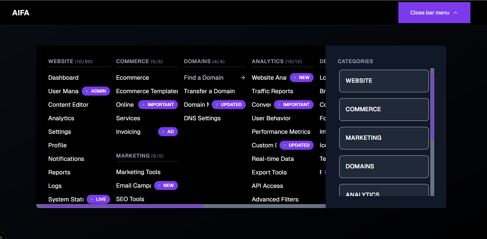

  

<h1 align="center">AIFA Navigation Menu</h1>

  
  
  

> An elegant, adaptive, and open-source navigation menu for React/Next.js. It allows you to easily manage an infinite number of nested links and categories, as well as control access to menu items based on user roles.

  

## 🚀 About The Project

**AIFA Navigation Menu** is a powerful, production-ready component for building complex navigation systems in modern web applications. Developed as part of the [AIFA Starter Kit](https://github.com/aifa-agi/aifa), it is also a fully standalone solution that can be easily integrated into any React/Next.js project.

The menu was designed with flexibility, performance, and developer experience in mind, providing out-of-the-box functionality that typically requires significant implementation effort.

  <strong>Desktop Version (Mega Menu)</strong> 
  

  <strong>Mobile Version</strong> 
  

  <strong>Role Simulator for RBAC Demonstration</strong> 
  

## ✨ Core Features

This component comes packed with a set of powerful, ready-to-use features:

-   **🎛️ Role-Based Access Control (RBAC):** Easily configure the visibility of links and entire menu categories for different user roles (e.g., `Guest`, `Admin`, `Subscriber`).
-   **👨‍💻 Role Simulator:** A built-in tool for quickly demonstrating and testing RBAC without requiring actual authentication. Perfect for development and client presentations.
-   **🔗 Infinite Nesting:** Structure navigation of any complexity with an unlimited number of categories and subcategories.
-   **📱 Fully Responsive Design:** The component looks and functions great on all devices, automatically switching between an elegant mega menu on desktop and a convenient accordion on mobile.
-   **🎨 Customizable Badges:** Highlight important menu items with customizable badges like `NEW`, `IMPORTANT`, or `ADMIN` to attract user attention.
-   **🚀 High Performance:** Optimized for fast loading and smooth animations using `Framer Motion`.

-   **🎓 Master Next.js Catch-All Routes:** This starter is a perfect real-world example of Next.js App Router's powerful "catch-all" segments. It demonstrates how to generate hundreds of unique, SEO-friendly pages dynamically from a single file.
    -   **How it works:** All menu links, defined in a simple configuration file, are rendered using one central page component located at `app/[...params]/page.tsx`. This approach keeps your project organized and scalable, no matter how many pages you add.
    

      <em>One file structure to rule them all.</em> 
      
    

    

      <em>Generates a unique URL for every menu item.</em> 
      
    

    

      <em>And renders a unique, distinct page for each link.</em> 
      
    

## 🛠️ Technology Stack

The component is built using a modern and powerful technology stack:

| Category          | Technologies                                                                                                                                                    |
| :---------------- | :-------------------------------------------------------------------------------------------------------------------------------------------------------------- |
| **Framework**     | [Next.js](https://nextjs.org/) 15, [React](https://react.dev/) 19                                                                                               |
| **UI & UX**       | [shadcn/ui](https://ui.shadcn.com/), [Tailwind CSS](https://tailwindcss.com/), [Framer Motion](https://www.framer.com/motion/), [Lucide Icons](https://lucide.dev/) |
| **Code & Typing** | [TypeScript](https://www.typescriptlang.org/), [Zod](https://zod.dev/)                                                                                         |

## 🏁 Getting Started

To get a local copy up and running, follow these simple steps.

To get a local copy up and running, follow these simple steps.

## 📄 License

This project is distributed under the AGPL-3.0 license to ensure the openness of all derivative works.

## 🏋️‍♀️ Author

Roma Armstrong
telegram: **@roma_armstrong**

---

_The future is not written in corporate data centers, but in code that lives and evolves on millions of servers around the world._

